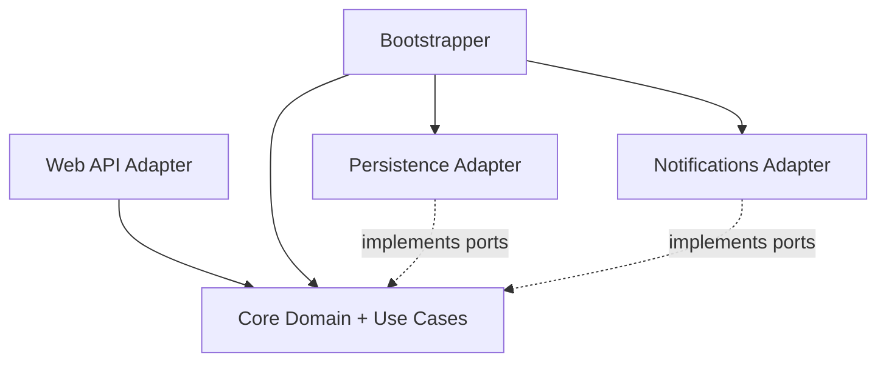
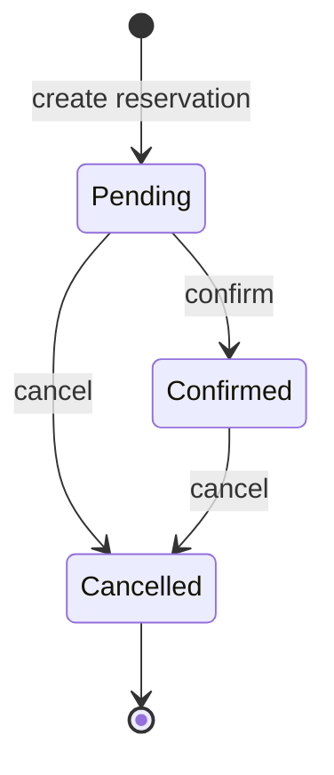

# Hotel Reservation

Hotel Reservation is a .NET backend for a hotel room reservation module. It is built around Hexagonal Architecture, Tactical DDD, CQRS, MediatR, EF Core, automated tests, and production-oriented boundaries.

The system focuses on the reservation workflow: searching availability, creating reservations, confirming reservations, cancelling reservations, and preventing overlapping bookings for the same room.

## Core Capabilities

- Search available rooms for a date range.
- Create, confirm, and cancel reservations.
- Reject overlapping reservations for the same room.
- Keep business rules inside the core domain and use cases.
- Access infrastructure through ports and adapters.
- Cover domain, use case, and integration behavior with automated tests.

## Architecture



The core owns the business model and application ports. Adapters depend on the core; the core does not depend on ASP.NET Core, EF Core, persistence, or notification implementations.

## Reservation Lifecycle



## Business Rules

- Check-out must be after check-in.
- Adjacent date ranges are allowed.
- Overlapping reservations for the same room are rejected.
- A new reservation starts as pending.
- Pending reservations can be confirmed or cancelled.
- Confirmed reservations can be cancelled.
- Cancelled reservations cannot be confirmed or cancelled again.

## Project Structure

```text
src/
  HotelReservation.Core                    domain model, use cases, ports
  HotelReservation.Adapter.WebApi          HTTP adapter and OpenAPI surface
  HotelReservation.Adapter.Persistence     EF Core persistence adapter
  HotelReservation.Adapter.Notifications   notification adapter
  HotelReservation.Bootstrapper            composition root
tests/
  HotelReservation.Core.Tests
  HotelReservation.UseCases.Tests
  HotelReservation.Integration.Tests
```

## Domain Model

| Type | Examples |
| --- | --- |
| Value objects | `DateRange`, `GuestInfo`, `Money` |
| Entities | `Room`, `Reservation` |
| Aggregate root | `Reservation` |
| Domain events | `ReservationCreatedEvent`, `ReservationConfirmedEvent`, `ReservationCancelledEvent` |
| Ports | `IReservationRepository`, `IRoomRepository`, `IClock`, `INotificationSender` |

## CQRS

Commands:

- `CreateReservationCommand`
- `ConfirmReservationCommand`
- `CancelReservationCommand`

Queries:

- `SearchAvailableRoomsQuery`
- `GetReservationByIdQuery`

## Verify

```powershell
dotnet build HotelReservation.slnx
dotnet test HotelReservation.slnx
```
